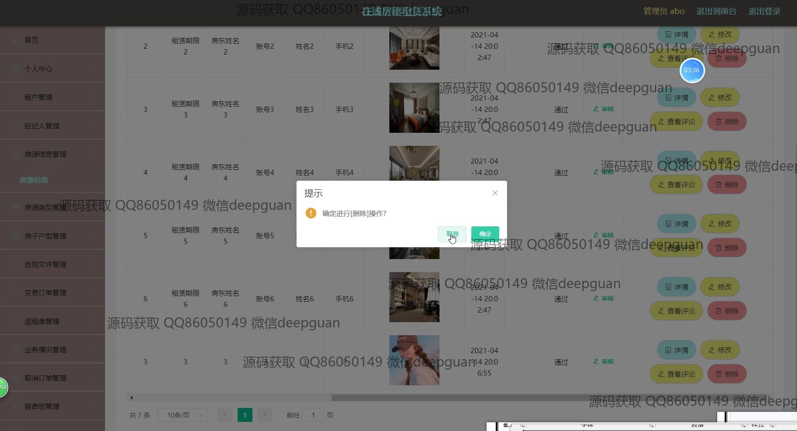
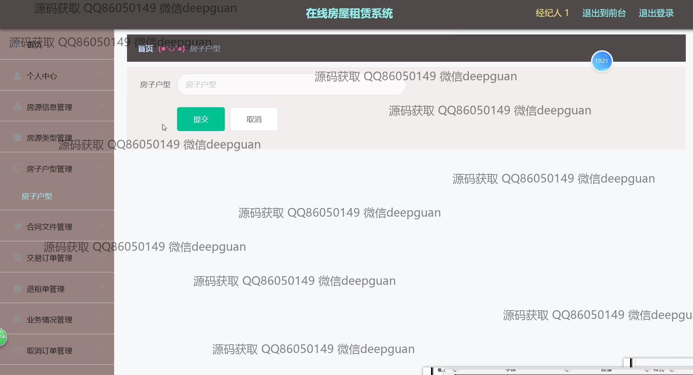

<h1 align="center">在线房屋租赁和电子签约系统的设计与实现+vue</h1>

## 简介
在线房屋租赁和电子签约系统：角色分为管理员、用户；提供房源管理、租户管理、合同电子签约、交易订单管理、经纪人管理、个人信息管理等功能。    --计算机毕业设计源码；毕设源码；java毕业设计源码

## 联系方式

<h3 align="center">获取完整代码与数据库文件 + 微信：deepguan QQ: 86050149 QQ群: 783742310</h3>

<h3 align="center">可帮忙远程部署 包运行成功！提供远程部署、修改代码、设计文档指导、代码讲解等服务！</h3>

## 功能介绍（完整见运行截图）
管理员：登录界面提供基础认证功能，允许管理员通过输入用户名、密码和验证码进行登录。主页导航提供租户管理、经纪人管理、房源信息管理、合同文件管理等模块，便于管理员快捷访问所需功能。房源管理页面允许管理员添加、删除、修改房屋信息，并支持查看详细信息及评论。交易订单管理功能支持订单的新增、查询、删除，并可以查看合同文件和订单详情，方便管理员审核和处理租赁事务。个人中心支持查看与修改个人信息，支持上传头像及更改密码，以维护账户的安全性。

租户：可以通过注册界面输入必要的个人信息进行注册，如账号、密码、姓名、手机号等，注册成功后可登录系统。个人中心提供个人信息的查看和编辑功能，用户可以更新个人资料和上传头像。租赁信息管理方便租户查看房源列表，进行房源搜索及选择，查看房源详细信息，包括租金、租期、房东信息等。支持在线申请租赁和进行电子签约，提升租赁过程的便捷度。

经纪人：注册并登录系统后，可以在个人中心查看并编辑自身信息，包括账号、姓名、年龄、联系方式等。经纪人管理模块允许查看和处理与房源相关的业务，包括添加新房源、编辑房源详情及维护现有房源信息。可以通过系统发布房源，并为租户提供租赁服务与支持，确保信息的实时更新与准确性。

用户：用户在个人中心可以管理租赁相关信息，查看和修改个人资料，管理收藏的房源。用户模块允许查看房源信息、租赁合同和交易订单等详细信息，提供直观的房源展示和合同管理。系统采用客服中心模块，支持用户通过对话框与客服进行实时交流，以解决使用过程中遇到的问题并提高用户体验。导航栏提供各模块快捷入口，简化用户的操作流程并提高效率。

## 运行截图

本代码来源于网络,仅供学习参考使用!

